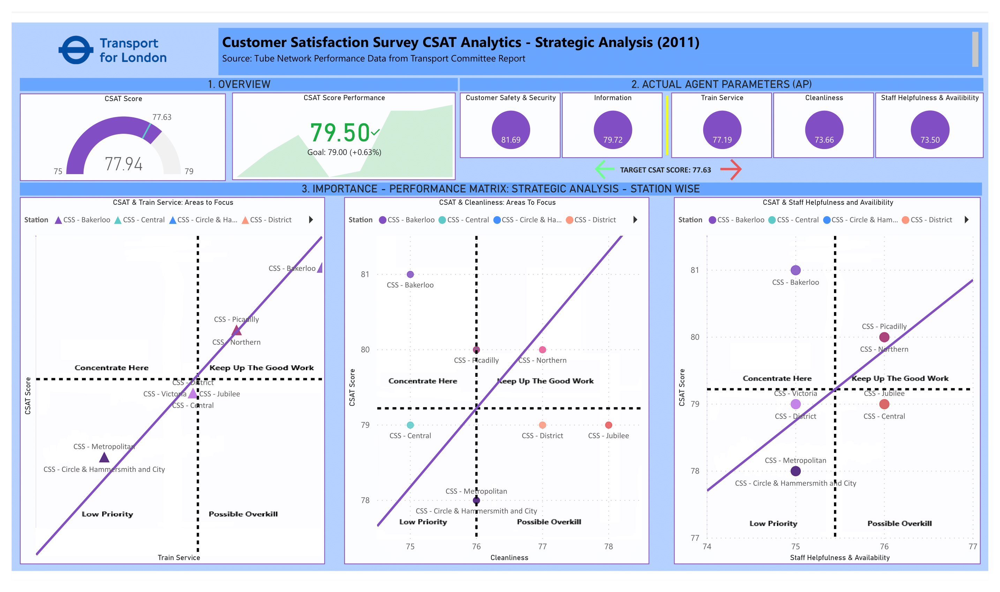

# TfL-Customer Satisfaction Survey Analysis (2011 Data)

An Overall CSAT is a favorable score of 77.94 as it exceeds the Expected CSAT score of 77.63
- CSAT Score demonstrates a good performance of CSAT 79.50 as it exceeds the expected CSAT of 79. 
- Customer Safety & Security and Information are favorably performing parameters because they exceed the Expected CSAT. 
- Train Service, Cleanliness, and Staff Helpfulness & Availability are adversely performing variables because they score less than the Expected CSAT.

## Managerial Implications
### Importance-Performance Analysis
An importance-performance analysis shown in Figure 3 demonstrates how the three adverse performing agent parameters perform against the overall CSAT score. The diagonal line (iso-priority) line implies that performance equals importance and the points above it fail to meet the expected performance score and require management attention. 
### Garnering A Strategic Focus
The strategic analysis concludes as follows;
- Train service: Performance at Picadilly Line requires focus to improve the score, whereas Circle & Hammersmith and City and Metropolitan Lines require management attention but are low priority 
- Cleanliness: Performance at Bakerloo and Picadilly Lines require focus to improve the score, whereas the Central Line require management attention but are low priority 
- Staff Helpfulness and Availability: Bakerloo, Picadilly, and Northern Lines need management focus as they are a high priority to improve the score, whereas Victoria and District Lines require management attention but are low priority 

## Take-aways
In recent times there is an increasing empahsis on customer satisfaction to retain consumers because it is largely understood that it is less costly to keep existing customers than gaining new ones. For many organizations in the public sector, customer satisfaction will itself be the measure of success and to maintain paramteres which facilitate the metric is highly cirtical to achieving agency long and short term goals.

